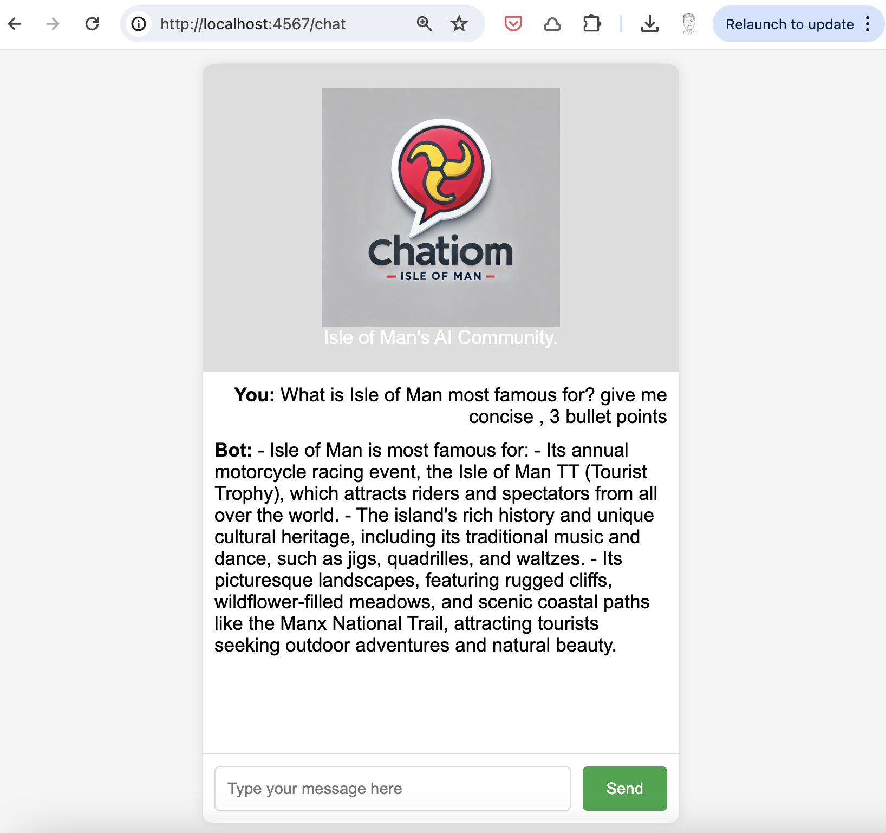

# ChatIOM

***Isle of Man's Community-First, Privacy-First gateway to AI Adoption***

ChatIOM is community-led project entirely developed using AI Agents and passionate community volunters, designed to serve as a safe haven for the Isle of Man's AI community. It operates on private infrastructure, ensuring security and privacy for its users.

## Key Features

- **AI-Driven Development**: This initial version of ChatIOM is built by human and AI team-members working together. Below is the transcript of pair-programming with AI that helped generate the code for this. 

- **Community Focused**: Aimed at fostering a vibrant AI community within the Isle of Man, offering a space for learning, sharing, and growth.

- **Distributed Inference Infrastructure**: As ChatIOM is a community project it is built on top of [GAIANET](https://www.gaianet.ai/) which allows local partners and volunteers to provide shared inference ingrastructure. 

### Chat Transcript

## Access

The platform is accessible via the GaiaNet node at [https://chatiom-community.manx.ai](https://chatiom-community.manx.ai), offering seamless connectivity for users.

## Contribution

We welcome contributions from the community to enhance and expand the capabilities of ChatIOM. Join us in building a robust AI ecosystem for the Isle of Man.
Just fork this repository and start building. 

---

